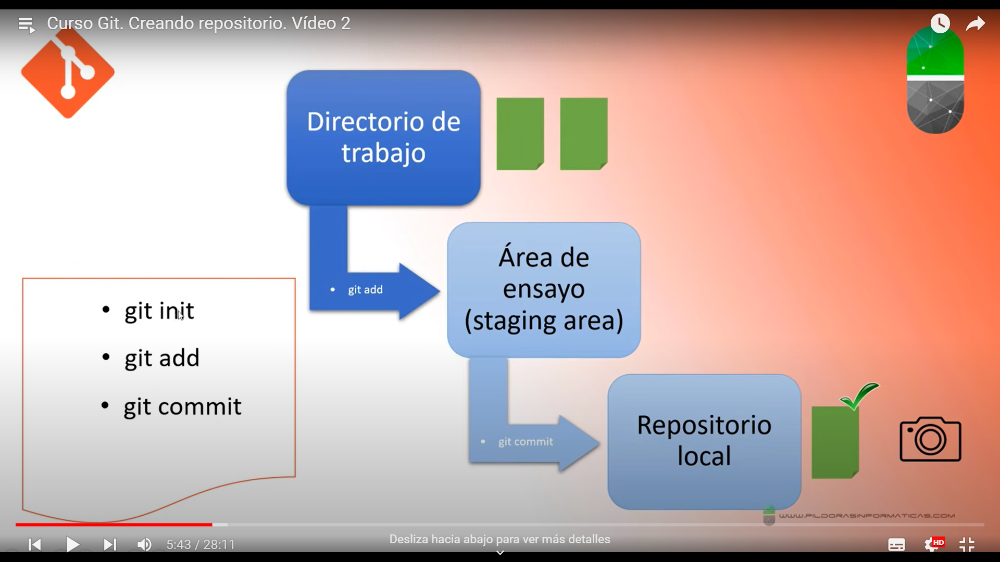

## Índice
1. [git init](#git-init)
2. [git add](#git-add)
3. [git commit](#git-commit)

## git init
Una vez que ya tenemos nuestro directorio de trabajo, si queremos que git haga un seguimiento de todos nuestros archivos o parte de ellos y hacer un respaldo, el primer comando que tenemos que utilizar es __git init__ Este comando solo se ejecuta una vez, al iniciar nuestro proyecto o cuando queremos que git comience hacer un seguimiento de nuestro proyecto. En general siempre utilizaremos este proyecto cuando empecemos nuestro proyecto.
## git add
El comando que tenemos que utilizar para indicarle a git qué archivos queremos que haga el seguimiento es __git add__ De este modo, conseguimos que git lleve este archivo desde el DIRECTORIO DE TRABAJO a ÁREA DE ENSAYO (STAGING AREA) aunque nosotros no apreciaríamos nada porque esto se produce a nivel interno.
## git commit
Una vez que tenemos el archivo/s en el ÁREA DE ENSAYO utilizamos el comando __git commit__ este comando lo que hace es traslar el archivo/s que tengamos en el ÁREA DE ENSAYO al ÁREA DE REPOSITORIO LOCAL, que es ahí donde se crea el respaldo.

  

## git status -s
Nos da un listado con todos los archivos y directorios que tenemos en la carpeta del proyecto. Los signos de interrogación rojos a la izquierda indican que ninguno de estos archivos y directorios está siendo sometido a seguimiento por parte de git.
## git log --oneline
Para ver un listado de todas las copias, de todos los commits que tenemos en el repositorio local.
## git reset --hard 
Con este comando, seguido del código facilitado por __git log --oneline__ podremos hacer una restauración del archivo al que queremos retornar.

Las ramas o branch son una rama o líneas de tiempo.
Con git podemos crear no sólo una rama que es la que nos crea git por defecto (rama master) sino que mientras desarrollamos nuestro proyecto podemos crear varias lineas paralelas o ramas.
¿Qué ocurre con los proyectos complejos y/o participan varias personas?
Puedes encontrarte en un punto determinado del proyecto y has hecho un commit y descubres que las cosas en el proyecto no van como tu esperabas, descubres un fallo o no refleja bien lo que tu quieres mostrar (por ejemplo el diseño) Como solución, podrías volver a una versión anterior, lo que ocurre es que en proyectos complejos, esto puede ocurrir varias veces. También puede ocurrir que una persona se ocupe de una parte y otra persona de otra parte.  
Aunque por defecto trabajes con la rama Master, puedes trabajar con otras ramas paralelas
Para crear una rama:  
__git branch nombreRama__
Para ver las ramas que tienes y en la rama en la que te encuentras:
__git branch__
Estamos en aquella que tiene el asterisco
Para seleccionar la rama con la que quieres trabajar:
__git checkout nombreRama__
Para borrar una rama en el repositorio local:
__git branch -d nombreRama__
Para borrar una rama en el repositorio remoto:
__git push origin --delete nombre-de-rama__
Para hacer un merge:
Tienes que estar obligatoriamente en la rama master
__git merge nombreRama__
